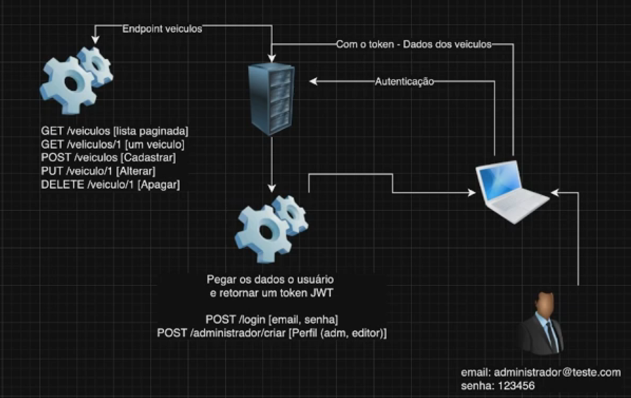
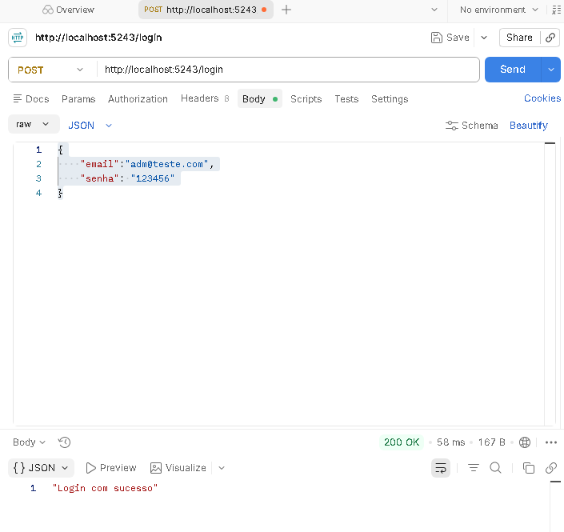
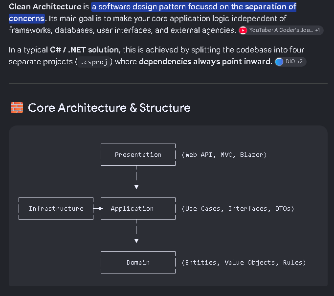
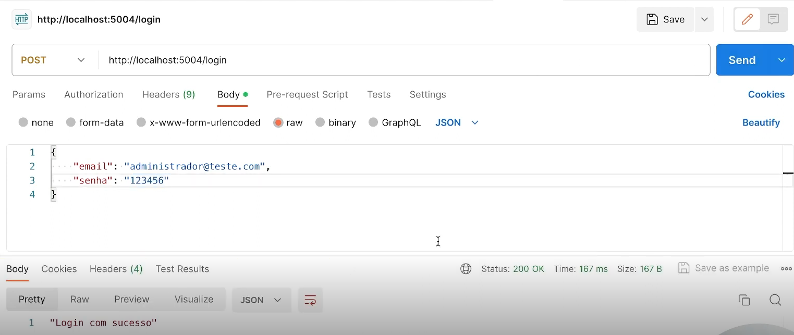
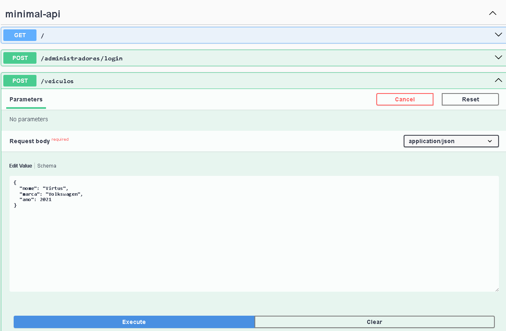
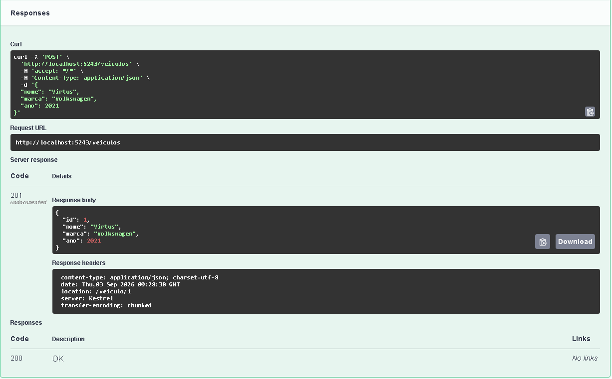
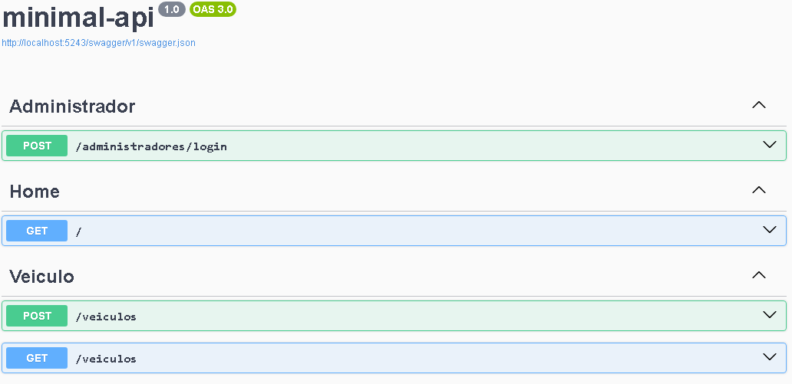
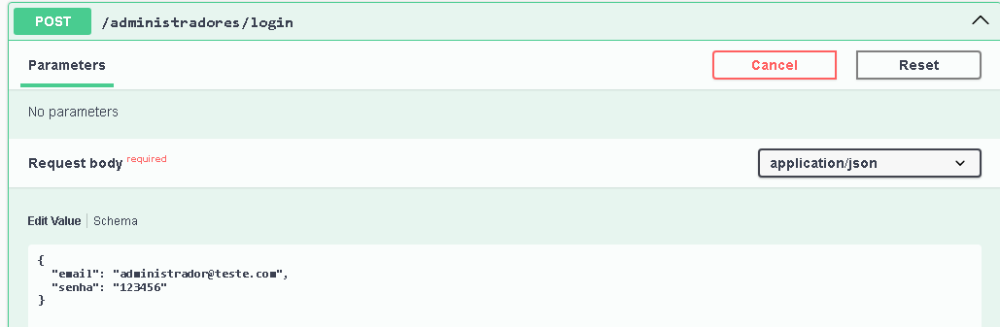
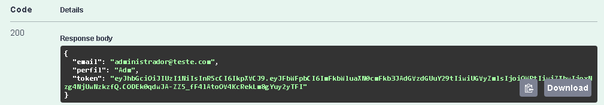
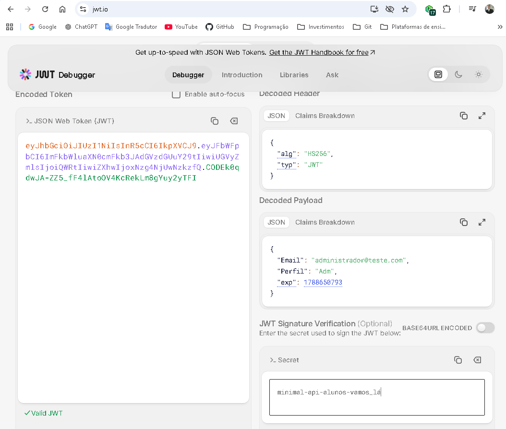

# O que precisa ter instalado para começar?

1. Instalação do dotnet 
    - Comando para verificar versão -> dotnet --version
2. Um terminal para digitar os comandos do dotnet
3. Uma IDE (Visual Studio ou VsCode)
    - Instalar as extensões do C# e o .Net Install Tool
4. Um banco de dados MySql por exemplo
5. app.diagrams.net programa para fazer diagramas
6. Conta no Github para versionamento
7. Instalar o Postman para testes

# Criando Projeto e entendo o código do boilerplate

1. Para criar o projeto digitar na linha de comando 
    ->dotnet new web - nomeProjeto
    Vai criar o projeto através do Boilerplate que é um projeto inicial.

# Startando a aplicação
Na linha de comando digitar:
    ->dotnet run ou
    ->dotnet watch run - esse comando aplica as alterações do código na aplicação em tempo real.

# Criando uma rota de validação de login e senha em memória

Na classe Program.cs abaixo do app.MapGet(); colocar o código abaixo

app.MapPost("/login", (LoginDTO loginDTO) => {
    if(loginDTO.Email == "adm@teste.com" && loginDTO.Senha == "123456")
    {
        return Results.Ok("Login com sucesso");
    }
    else
    {
        return Results.Unauthorized();
    }
});

Criar a classe após app.Run();

public class LoginDTO
{
    public string Email{get; set;} = default!;
    public string Senha{gte;set;} = default!;
}

# Testando a validação
No Postman criar uma nova requisição.
    - No campo de metodo colocar a Opção POST
    - Na URL colocar a URL da aplicação /login
    - Clicar em Body selecionar a opção raw e JSON e no campo de texto colocar a código abaixo
        {
            "email":"adm@teste.com",
            "senha": "123456"
        }

    Tem que retornar a mensagem Login com sucesso no Postman

# Configurando o Entity Framework e tabela de administradores

1. Acessar o site ([nuget.org](https://www.nuget.org/))
2. Na busca digitar entity framework
3. Selecionar a opção Microsoft.EntityFrameworkCore
4. Selecionar a versão do dotnet da aplicação
5. Copiar o comando do campo .NetCLI
6. Colar na linha de comando do Vscode, neste momento será instalado e adicionado o código no .csproj
7. Na busca do Nuget digitar Microsoft.EntityFrameworkCore.Design
8. Selecionar a versão do dotnet da aplicação
9. Realizar os passos 5 e 6 acima.
10. Na busca do Nuget digitar Microsoft.EntityFrameworkCore.Tools
11. Realizar os passos do 4 ao 6
12. Na busca do Nuget digitar Pomelo.EntityFrameworkCore.MySql
13. Realizar os passos do 4 ao 6

# Organizando as pastas do projeto

Utilizando clean architecture

1. Criar a pasta Dominio
   - Dentro da pasta Dominio criar a pasta DTOs
   - Dentro da pasta DTOs 
     - Criar um arquivo.gitkeep
     - Colocar a classe LoginDTO.cs
       - Na classe colocar o namespace MinimalApi.DTOs;
   - Criar a pasta Entidades
     - Dentro da pasta Entidades 
       - Criar um arquivo.gitkeep
   - Criar a pasta Servicos
     - Dentro da pasta Servicos
       - Criar um arquivo.gitkeep
4. Criar a pasta Infraestrutura
   - Dentro da pasta Infraestrutura criar a pasta DB
     - Dentro da pasta DB
       - Criar um arquivo.gitkeep
       - Criar o arquivo DbContexto.cs
         - Dentro desse arquivo colocar o código abaixo
     
     namespace MinimalApi.infraestrutura.Db;

     public class DbContexto
     {

     }

# Colocando a aplicação no GitHub

   1. Na pasta raiz do projeto
      - Criar o arquivo .gitignore
      - ir no site ([gitignore.io] https://www.toptal.com/developers/gitignore/) e digitar na busca 
        - Windows
        - macOS
        - Linux
        - DotnetCore
        - VisualStudioCode
      - Copiar o código e colar dentro do arquivo .gitignore
   2. No terminal digitar os comandos
      - ->git init
      - ->git add .
      - ->git commit -m "Iniciando Projeto"
   3. Ir no GitHub e criar o repositorio
      - Copiar o a url para conectar o repositorio local ao remoto
   4. No terminal digitar os comandos
      - git remote add origin URLcopiada
      - git branch -M main
      - git push -u origin main
    

# Criando o contexto

1. Na classe DbContexto.cs inserir o código abaixo
   - -> using Microsoft.EntityFrameworkCore;
        using MinimalApi.Dominio.Entidades;

        namespace MinimalApi.Infraestrutura.DB;
        public class DbContexto : DbContext
        {
            private readonly IConfiguration _configuracaoAppSettings;
            
            public DbContexto(IConfiguration configuracaoAppSettings)
            {
                _configuracaoAppSettings = configuracaoAppSettings;
            }

            public DbSet<Administrador> Administradores {get; set;} = default!;

            protected override void OnConfiguring(DbContextOptionsBuilder optionsBuilder)
            {
                if(!optionsBuilder.IsConfigured)
                {
                var stringConexao = _configuracaoAppSettings.GetConnectionString("mysql")?.ToString();

                if(!string.IsNullOrEmpty(stringConexao))
                {
                    optionsBuilder.UseMySql(stringConexao, ServerVersion.AutoDetect(stringConexao));
                }
                }
            }
        }
2. Na pasta Entidades
   - Criar uma classe Administrador.cs
   - Dentro de Administrador.cs colocar o código abaixo
     - -> namespace MinimalApi.Dominio.Entidades;
     public class Administrador
     {
        [Key]
        [DatabaseGenerated(DatabaseGeneratedOption.Identity)]
        public int Id { get; set; } = default!;
        [Required]
        [StringLength(255)]
        public string Email { get; set; } = default!;
        [StringLength(50)]
        public string Senha { get; set; } = default!;
        [StringLength(10)]
        public string Perfil { get; set; } = default!;
     }

3. No arquivo appsettings.json colocar o código abaixo após AllowedHosts
   - -> "ConnectionStrings":{
    "mysql": "Server=localhost;Database=minimal_api;Uid=root;Pwd=root;"
   }

4. No arquivo Program.cs acrescentar ao código
    - -> using MinimalApi.DTOs;

    abaixo de var builder colocar 
    - builder.Services.AddDbContext<DbContexto>(options => {options.UseMySql(builder.Configuration.GetConnectioString("mysql"),
    ServerVersion.AutoDetect(builder.Configuration.GetConnectionString("mysql)));
    });

# Gerando o Migration

1. No console digitar o comando
    - -> dotnet ef --version
    se não aparecer a versão instalar o dotnet framework
    - -> dotnet ef migrations add AdministradorMigration
    Será compilado o código e criado a pasta Migrations

2. Digitar no console o comando de criação da base de dados no banco de dados
    - -> dotnet ef database update

# Verificando a criação da database através do terminal do vscode

1. Digitar no console
    - -> mysql -u root -p (Após o enter digitar a senha do banco de dados)
    - -> use minimal_api;
    - -> show tables;
    - -> desc NomeDaTabela;

    caso não reconheça o comando mysql, fechar o vscode e abrir novamente.

# Criando um Seed para criar o administrador no banco de dados

1. Na classe DbContexto acrescentar o código abaixo da linha do DbSet
    - -> 
    protected override void OnModelCreating(ModelBuilder modelBuilder)
    {
        modelBuilder.Entity<Administrador>().HasData(
            new Administrador {
                Id = 1,
                Email = "administrador@teste.com",
                Senha = "123456";
                Perfil = "Adm"
        }
        );
    }

2. No console digitar o comando abaixo
    - dotnet ef migrations add SeedAdministrador
    - dotnet ef database update

3. Abrir um terminal secundário para rodar somente os comandos do mysql
    - Testar com o SELECT * administradores;

# Validando administrador com login e senha no banco de dados

1. Na pasta Dominio criar uma pasta de Interfaces;
2. Na pasta de Interfaces criar o arquivo iAdministradorServico.cs;
3. Colocar o código 
    - -> 
    using MinimalApi.Dominio.Entidades;
    using MinimalApi.DTOs;

    namespace MinimalApi.Dominio.Interfaces;

    public interface iAdministradorServico
    {
        Administrador? Login(LoginDTO loginDTO);
    }

4. Na pasta Servicos criar um arquivo AdministradorServico.cs
5. Colocar o código
    - ->
    using MinimalApi.DTOs;
    using MinimalApi.Infraestrutura.Db;

    namespace MinimalApi.Dominio.Servicos;

    public class AdministradorServico : iAdministradorServico
    {
        private readonly DbContexto _contexto;

        public AdministradorServico(DbContexto contexto)
        {
            _contexto = contexto;
        }
        public Administrador? Login(LoginDTO loginDTO)
        {
            var adm = _contexto.Administradores.Where(a => a.Email == loginDTO.Email && a.Senha == loginDTO.Senha).FirstOrDefault(); 
                return adm;
        }
    }

6. Em Program.cs abaixo da linha var builder
    - -> builder.Services.AddScoped<IAdministradorServico, AdministradorServico>();
7. Na linha app.MapPost alterar
    - ->
    app.MapPost("/login", ([FromBody] LoginDTO loginDTO, IAdministradorServico administradorServico)=> {
        if(administradorServico.Login(loginDTO) != null)
            return Results.Ok("Login com sucesso");
        else
            return Results.Unauthorized();

    } );

8. Rodar a aplicação
    no terminal digitar dotnet watch run

9. Abrir o postman e fazer o envio

# Configurando modelo de veículos
1. Na pasta Entidades criar um arquivo Veiculo.cs
2. Colocar o código abaixo
    - -> 
    using System.ComponentModel.DataAnnotations;
using System.ComponentModel.DataAnnotations.Schema;

namespace minimal_api.Dominio.Entidades
{
    public class Veiculo
    {
        [Key]
        [DatabaseGenerated(DatabaseGeneratedOption.Identity)]
        public int Id { get; set; } = default!;

        [Required]
        [StringLength(150)]
        public string Nome { get; set; } = default!;

        [Required]
        [StringLength(100)]
        public string Marca { get; set; } = default!;

        [Required]
        public int Ano { get; set; } = default!;

    }
}

3. Na Classe DBContexto.cs colocar o codigo
    - ->
    public DbSet<Veiculo> Veiculos {get; set; } = default!;

4. Criar a Migration com o comando abaixo no terminal
    - ->
    dotnet ef migrations add VeiculosMigration
    dotnet ef database update

5. No terminal do MySql digitar
    - ->
    desc veiculos;

6. Na pasta Interfaces criar o arquivo IVeiculoServico.cs com o código abaixo
    - ->
    using MinimalApi.Dominio.Entidades;
    using MinimalApi.DTOs;

    namespace MinimalApi.Dominio.Interfaces;

    public interface IVeiculoServico
    {
        List<Veiculo> Todos(int pagina = 1, string? nome = null, string? marca = null );

        Veiculo BuscaPorId(int id);
        void Incluir(Veiculo veiculo);
        void Atualizar(Veiculo veiculo);
        void Apagar(Veiculo veiculo);

    }

7. Na pasta de Servico criar o arquivo VeiculoServico.cs com o código
    - ->
using Microsoft.EntityFrameworkCore;
using minimal_api.Dominio.Entidades;
using MinimalApi.Dominio.Interfaces;
using MinimalApi.infraestrutura.Db;

namespace minimal_api.Dominio.Servicos
{
    public class VeiculoServico : IVeiculoServico
    {
        private readonly DbContexto _contexto;

        public VeiculoServico(DbContexto contexto)
        {
            _contexto = contexto;
        }

        public void Apagar(Veiculo veiculo)
        {
            _contexto.Veiculos.Remove(veiculo);
            _contexto.SaveChanges();
        }

        public void Atualizar(Veiculo veiculo)
        {
            _contexto.Veiculos.Update(veiculo);
            _contexto.SaveChanges();
        }

        public Veiculo? BuscaPorId(int id)
        {
            return _contexto.Veiculos.Where(v => v.Id == id).FirstOrDefault();
        }

        public void Incluir(Veiculo veiculo)
        {
            _contexto.Veiculos.Add(veiculo);
            _contexto.SaveChanges();
        }

        public List<Veiculo> Todos(int pagina = 1, string? nome = null, string? marca = null)
        {
            var query = _contexto.Veiculos.AsQueryable();

            if (!string.IsNullOrEmpty(nome))
            {
                query = query.Where(v => EF.Functions.Like(v.Nome.ToLower(), $"%{nome}%"));
            }

            int itensPorPagina = 10;

            query = query.Skip((pagina - 1) * itensPorPagina).Take(itensPorPagina);

            return query.ToList();
        }
    }
}

# Configurando o Swagger na Aplicação

1. Acessar a página nuget.org
2. Buscar swagger
3. Selecionar Swashbuckle.AspNetCore
4. Copiar o link do .Net CLI e executar no terminal, verificar no arquivo .csproj se instalou o pacote
5. Compilar a aplicação com dotnet build

6. Na classe Program.cs colocar abaixo do código builder.Services.AddScoped
    builder.Services.AddEndpointsApiExplorer();
    builder.Services.AddSwaggerGen();

7. Ainda na classe Program.cs acima do app.Run() colocar;
    app.UseSwagger();
    app.UseSwaggerUI();

8. No terminal digitar dotnet run 

9. No navegar digitar localhost + a porta = /swagger (http://localhost:5243/swagger) que deverá abrir a interface do swagger.

# Criando rota Home respondendo por Json

1. Dentro da pasta Dominio criar uma pasta ModelViews
2. Dentro de ModelViews criar a classe Home.cs com o código abaixo
   - ->
   
namespace minimal_api.Dominio.ModelViews
{
    public struct Home
    {
        public string Mensagem { get => "Bem vindo ao meu mundo!"; }
        public string Doc { get => "/swagger"; }
    }
} 

3. Na classe Program.cs no app.MapGet alterar para
    - ->
   
using Microsoft.AspNetCore.Mvc;
using Microsoft.EntityFrameworkCore;
using minimal_api.Dominio.DTOs;
using minimal_api.Dominio.Entidades;
using minimal_api.Dominio.ModelViews;
using minimal_api.Dominio.Servicos;
using MinimalApi.Dominio.Interfaces;
using MinimalApi.Dominio.Servicos;
using MinimalApi.DTOs;
using MinimalApi.infraestrutura.Db;

#region Builder
var builder = WebApplication.CreateBuilder(args);

builder.Services.AddScoped<iAdministradorServico, AdministradorServico>();
builder.Services.AddScoped<IVeiculoServico, VeiculoServico>();

builder.Services.AddEndpointsApiExplorer();
builder.Services.AddSwaggerGen();

builder.Services.AddDbContext<DbContexto>(options =>
{
    options.UseMySql(builder.Configuration.GetConnectionString("mysql"),
    ServerVersion.AutoDetect(builder.Configuration.GetConnectionString("mysql")));
});

var app = builder.Build();
#endregion

#region Home
app.MapGet("/", () => Results.Json(new Home()));
#endregion

#region Administradores
app.MapPost("/administradores/login", ([FromBody] LoginDTO loginDTO, iAdministradorServico administradorServico) =>
{
    if (administradorServico.Login(loginDTO) != null)
    {
        return Results.Ok("Login com sucesso");
    }
    else
    {
        return Results.Unauthorized();
    }

});
#endregion

#region Veiculos
app.MapPost("/veiculos", ([FromBody] VeiculoDTO veiculoDTO, IVeiculoServico veiculoServico) =>
{
    var veiculo = new Veiculo
    {
        Nome = veiculoDTO.Nome,
        Marca = veiculoDTO.Marca,
        Ano = veiculoDTO.Ano
    };

    veiculoServico.Incluir(veiculo);
    return Results.Created($"/veiculo/{veiculo.Id}", veiculo);

});
#endregion

#region CodigoInicial
// app.MapPost("/login", (LoginDTO loginDTO) =>
// {
//     if (loginDTO.Email == "adm@teste.com" && loginDTO.Senha == "123456")
//     {
//         return Results.Ok("Login com sucesso");
//     }
//     else
//     {
//         return Results.Unauthorized();
//     }
// });
#endregion

#region App
app.UseSwagger();
app.UseSwaggerUI();

app.Run();
#endregion

# POST para veículos
1. Na pasta DTO criar a classe VeiculosDTO.cs e colocar o código abaixo
    - ->

using System;
using System.Collections.Generic;
using System.Linq;
using System.Threading.Tasks;

namespace minimal_api.Dominio.DTOs
{
    public record VeiculoDTO
    {
        public string Nome { get; set; } = default!;
        public string Marca { get; set; } = default!;
        public int Ano { get; set; } = default!;
    }
}

2. Rodar a aplicação e no swagger inserir os dados para cadastro do veículo clicando em veiculos, inserindo os dados e clicar no botão execute

a resposta positiva fica logo abaixo conforme imagem

# GET para retornar veículos

1. Na classe Program.cs dentro da region veículos incluir o código abaixo
    - ->
    app.MapGet("/veiculos", ([FromQuery] int? pagina, IVeiculoServico veiculoServico) =>
{
    var veiculos = veiculoServico.Todos(pagina);

    return Results.Ok(veiculos);
});

2. Na classe IVeiculoServico.cs colocar após o int o sinal de ? 
   - List<Veiculo> Todos(int? pagina = 1, string? nome = null, string? marca = null);

3. Na classe VeiculoServico.cs colocar após o int o sinal de ?
   - public List<Veiculo> Todos(int? pagina = 1, string? nome = null, string? marca = null)

4. Rodar a aplicação e testar se está retornando o veículo cadastrado no banco de dados no swagger

# Organizando rotas por contexto no swagger

1. Adicionar o metodo WithTags no final de cada mapeamento em Home, Administradores e veiculos igual ao exemplo abaixo.

app.MapGet("/veiculos", ([FromQuery] int? pagina, IVeiculoServico veiculoServico) =>
{
    var veiculos = veiculoServico.Todos(pagina);

    return Results.Ok(veiculos);
}).WithTags("Veiculo");

resultado da alteração

# GET para retornar veículos

1. Na classe Program.cs dentro da region veículos incluir o código abaixo
    - ->
    app.MapGet("/veiculos/{id}", ([FromQuery] int id, IVeiculoServico veiculoServico) =>
{
    var veiculos = veiculoServico.BuscaPorId(id);

    if (veiculos == null)
    {
        return Results.NotFound();
    }
    return Results.Ok(veiculos);
    
}).WithTags("Veiculo");

# PUT para atualizar veiculo
1. Na classe Program.cs dentro da region veículos incluir o código abaixo
    - ->
    app.MapPut("/veiculos/{id}", ([FromQuery] int id, VeiculoDTO veiculoDTO ,IVeiculoServico veiculoServico) =>
{
    var veiculos = veiculoServico.BuscaPorId(id);

    if (veiculos == null)
    {
        return Results.NotFound();
    }
    veiculos.Nome = veiculoDTO.Nome;
    veiculos.Marca = veiculoDTO.Marca;
    veiculos.Ano = veiculoDTO.Ano;

    veiculoServico.Atualizar(veiculos);

    return Results.Ok(veiculos);

}).WithTags("Veiculo");

# DELETE para apagar veiculo
1. Na classe Program.cs dentro da region veículos incluir o código abaixo
    - ->
    app.MapDelete("/veiculos/{id}", ([FromQuery] int id, IVeiculoServico veiculoServico) =>
{
    var veiculos = veiculoServico.BuscaPorId(id);

    if (veiculos == null)
    {
        return Results.NotFound();
    }
    veiculoServico.Apagar(veiculos);

    return Results.NoContent();

}).WithTags("Veiculo");

# Criando validação ao cadastrar e atualizar veiculo

1. Na pasta ModelViews criar uma classe ErrosDeValidacao.cs e colocar o código abaixo
    - ->
    namespace minimal_api.Dominio.ModelViews
{
    public struct ErrosDeValidacao
    {
         public List<string> Mensagens { get; set; }
    }
}

2. Na classe Program.cs dentro da region veículos incluir o código abaixo
    - ->
    ErrosDeValidacao validaDTO(VeiculoDTO veiculoDTO)
{
    var validacao = new ErrosDeValidacao { 
        Mensagens = new List<string>() };

    if (string.IsNullOrEmpty(veiculoDTO.Nome))
        validacao.Mensagens.Add("O nome não pode ficar em branco");

    if (string.IsNullOrEmpty(veiculoDTO.Marca))
        validacao.Mensagens.Add("A marca não pode ficar em branco");

    if (veiculoDTO.Ano < 1950)
        validacao.Mensagens.Add("Veículo muito antigo, aceito somente anos superiores a 1950");

    return validacao;
}

3. Na classe Program.cs dentro da region veículos em app.MapPost incluir o código abaixo
    - ->
    app.MapPost("/veiculos", ([FromBody] VeiculoDTO veiculoDTO, IVeiculoServico veiculoServico) =>
{
    var validacao = validaDTO(veiculoDTO);

    if (validacao.Mensagens.Count > 0)
    {
        return Results.BadRequest(validacao);
    }

    var veiculo = new Veiculo
    {
        Nome = veiculoDTO.Nome,
        Marca = veiculoDTO.Marca,
        Ano = veiculoDTO.Ano
    };

    veiculoServico.Incluir(veiculo);
    return Results.Created($"/veiculo/{veiculo.Id}", veiculo);
}).WithTags("Veiculo");

4. Na classe Program.cs dentro da region veículos em app.MapPut incluir o código abaixo
   - ->
   app.MapPut("/veiculos/{id}", ([FromQuery] int id, VeiculoDTO veiculoDTO, IVeiculoServico veiculoServico) =>
{
    var veiculos = veiculoServico.BuscaPorId(id);

    if (veiculos == null)
    {
        return Results.NotFound();
    }

     var validacao = validaDTO(veiculoDTO);

    if (validacao.Mensagens.Count > 0)
    {
        return Results.BadRequest(validacao);
    }
    
    veiculos.Nome = veiculoDTO.Nome;
    veiculos.Marca = veiculoDTO.Marca;
    veiculos.Ano = veiculoDTO.Ano;

    veiculoServico.Atualizar(veiculos);

    return Results.Ok(veiculos);

}).WithTags("Veiculo");

# Criando EndPoints para administrador
1.  Na classe Program.cs dentro da region Administradores em app.MapPut incluir o código abaixo
   - ->

# Configurando token JWT no projeto
1. Instalar o pacote do token JWT digitando o comando abaixo no terminal
    - -> dotnet add package Microsoft.AspNetCore.Authentication.JwtBearer
2. No arquivo appsettings colocar o código abaixo
    - ->
    ,
"Jwt": "minimal-api-alunos-vamos_lá"

3. Na classe Program.cs na region Builder adicionar o código abaixo.
    - ->
   var builder = WebApplication.CreateBuilder(args);
//Builder do JWT

var key = builder.Configuration.GetSection("Jwt").ToString();
if (string.IsNullOrEmpty(key)) key = "123456";

builder.Services.AddAuthentication(option =>
{
    option.DefaultAuthenticateScheme = JwtBearerDefaults.AuthenticationScheme;
    option.DefaultChallengeScheme = JwtBearerDefaults.AuthenticationScheme;
}).AddJwtBearer(option =>
{
    option.TokenValidationParameters = new TokenValidationParameters
    {
        ValidateLifetime = true,
        IssuerSigningKey = new SymmetricSecurityKey(Encoding.UTF8.GetBytes(key))
    };
});
builder.Services.AddAutorization();

builder.Services.AddScoped<iAdministradorServico, AdministradorServico>();
builder.Services.AddScoped<IVeiculoServico, VeiculoServico>();

builder.Services.AddEndpointsApiExplorer();
builder.Services.AddSwaggerGen();

builder.Services.AddDbContext<DbContexto>(options =>
{
    options.UseMySql(builder.Configuration.GetConnectionString("mysql"),
    ServerVersion.AutoDetect(builder.Configuration.GetConnectionString("mysql")));
});

var app = builder.Build();

4. Na classe Program.cs na region App adicionar o código abaixo.
    - ->

app.UseSwagger();
app.UseSwaggerUI();

//config JWT
app.UseAuthentication();
app.UseAuthorization();

app.Run();

5.  Na classe Program.cs na region Administradores e veiculos adicionar o código abaixo.
    - ->
    #region Administradores
app.MapPost("/administradores/login", ([FromBody] LoginDTO loginDTO, iAdministradorServico administradorServico) =>
{
    if (administradorServico.Login(loginDTO) != null)
    {
        return Results.Ok("Login com sucesso");
    }
    else
    {
        return Results.Unauthorized();
    }
}).WithTags("Administrador");

app.MapGet("/administradores", ([FromQuery] int? pagina, iAdministradorServico administradorServico) =>
{
    var adms = new List<AdministradorModelView>();
    var administradores = administradorServico.Todos(pagina);

    foreach (var adm in administradores)
    {
        adms.Add(new AdministradorModelView
        {
            Id = adm.Id,
            Email = adm.Email,
            Perfil = (Perfil)Enum.Parse(typeof(Perfil), adm.Perfil)
        });
    }

    return Results.Ok(administradorServico.Todos(pagina));

}).RequireAuthorization().WithTags("Administrador");

app.MapGet("/administradores/{id}", ([FromQuery] int id, iAdministradorServico administradorServico) =>
{
    var adm = administradorServico.BuscaPorId(id);

    if (adm == null)
    {
        return Results.NotFound();
    }
    return Results.Ok(adm);

}).RequireAuthorization().WithTags("Administrador");

app.MapPost("/administradores", ([FromBody] AdministradorDTO administradorDTO, iAdministradorServico administradorServico) =>
{
    var validacao = new ErrosDeValidacao
    {
        Mensagens = new List<string>()
    };

    if (string.IsNullOrEmpty(administradorDTO.Email))
        validacao.Mensagens.Add("Campo Email não pode ficar em branco");
    if (string.IsNullOrEmpty(administradorDTO.Senha))
        validacao.Mensagens.Add("Campo Senha não pode ficar em branco");
    if (administradorDTO.Perfil == null)
        validacao.Mensagens.Add("Campo Perfil não pode ficar em branco");

    if (validacao.Mensagens.Count > 0)
    {
        return Results.BadRequest(validacao);
    }

    var adm = new Administrador
    {
        Email = administradorDTO.Email,
        Senha = administradorDTO.Senha,
        Perfil = administradorDTO.Perfil.ToString() ?? Perfil.Editor.ToString()
    };

    administradorServico.Incluir(adm);

    return Results.Created($"/administrador/{adm.Id}", adm);
    
}).RequireAuthorization().WithTags("Administrador");

#endregion

#region Veiculos

ErrosDeValidacao validaDTO(VeiculoDTO veiculoDTO)
{
    var validacao = new ErrosDeValidacao
    {
        Mensagens = new List<string>()
    };

    if (string.IsNullOrEmpty(veiculoDTO.Nome))
        validacao.Mensagens.Add("O nome não pode ficar em branco");

    if (string.IsNullOrEmpty(veiculoDTO.Marca))
        validacao.Mensagens.Add("A marca não pode ficar em branco");

    if (veiculoDTO.Ano < 1950)
        validacao.Mensagens.Add("Veículo muito antigo, aceito somente anos superiores a 1950");

    return validacao;
}

app.MapPost("/veiculos", ([FromBody] VeiculoDTO veiculoDTO, IVeiculoServico veiculoServico) =>
{
    var validacao = validaDTO(veiculoDTO);

    if (validacao.Mensagens.Count > 0)
    {
        return Results.BadRequest(validacao);
    }

    var veiculo = new Veiculo
    {
        Nome = veiculoDTO.Nome,
        Marca = veiculoDTO.Marca,
        Ano = veiculoDTO.Ano
    };

    veiculoServico.Incluir(veiculo);
    return Results.Created($"/veiculo/{veiculo.Id}", veiculo);
}).RequireAuthorization().WithTags("Veiculo");

app.MapGet("/veiculos", ([FromQuery] int? pagina, IVeiculoServico veiculoServico) =>
{
    var veiculos = veiculoServico.Todos(pagina);

    return Results.Ok(veiculos);
}).RequireAuthorization().WithTags("Veiculo");

app.MapGet("/veiculos/{id}", ([FromQuery] int id, IVeiculoServico veiculoServico) =>
{
    var veiculos = veiculoServico.BuscaPorId(id);

    if (veiculos == null)
    {
        return Results.NotFound();
    }
    return Results.Ok(veiculos);

}).RequireAuthorization().WithTags("Veiculo");

app.MapPut("/veiculos/{id}", ([FromQuery] int id, VeiculoDTO veiculoDTO, IVeiculoServico veiculoServico) =>
{
    var veiculos = veiculoServico.BuscaPorId(id);

    if (veiculos == null)
    {
        return Results.NotFound();
    }

    var validacao = validaDTO(veiculoDTO);

    if (validacao.Mensagens.Count > 0)
    {
        return Results.BadRequest(validacao);
    }

    veiculos.Nome = veiculoDTO.Nome;
    veiculos.Marca = veiculoDTO.Marca;
    veiculos.Ano = veiculoDTO.Ano;

    veiculoServico.Atualizar(veiculos);

    return Results.Ok(veiculos);

}).RequireAuthorization().WithTags("Veiculo");

app.MapDelete("/veiculos/{id}", ([FromQuery] int id, IVeiculoServico veiculoServico) =>
{
    var veiculos = veiculoServico.BuscaPorId(id);

    if (veiculos == null)
    {
        return Results.NotFound();
    }
    veiculoServico.Apagar(veiculos);

    return Results.NoContent();

}).RequireAuthorization().WithTags("Veiculo");

#endregion

6. Na classe Program.cs na region Administradores adicionar o código abaixo.
    - ->
   string GerarTokenJwt(Administrador administrador)
{

    if (string.IsNullOrEmpty(key))
    {
        return string.Empty;
    }
    var securityKey = new SymmetricSecurityKey(Encoding.UTF8.GetBytes(key));
    var credentials = new SigningCredentials(securityKey, SecurityAlgorithms.HmacSha256);

    var claims = new List<Claim>()
{
    new Claim("Email", administrador.Email),
    new Claim("Perfil", administrador.Perfil)
};

    var token = new JwtSecurityToken(
        claims: claims,
        expires: DateTime.Now.AddDays(1),
        signingCredentials: credentials
    );

    return new JwtSecurityTokenHandler().WriteToken(token);
}

app.MapPost("/administradores/login", ([FromBody] LoginDTO loginDTO, iAdministradorServico administradorServico) =>
{
    var adm = administradorServico.Login(loginDTO);

    if (adm != null)
    {
        string token = GerarTokenJwt(adm);
        return Results.Ok(new AdministradorLogado
        {
            Email = adm.Email,
            Perfil = adm.Perfil,
            Token = token

        });
    }
    else
    {
        return Results.Unauthorized();
    }
}).WithTags("Administrador");

app.MapGet("/administradores", ([FromQuery] int? pagina, iAdministradorServico administradorServico) =>
{
    var adms = new List<AdministradorModelView>();
    var administradores = administradorServico.Todos(pagina);

    foreach (var adm in administradores)
    {
        adms.Add(new AdministradorModelView
        {
            Id = adm.Id,
            Email = adm.Email,
            Perfil = (Perfil)Enum.Parse(typeof(Perfil), adm.Perfil)
        });
    }

    return Results.Ok(administradorServico.Todos(pagina));

}).RequireAuthorization().WithTags("Administrador");

app.MapGet("/administradores/{id}", ([FromQuery] int id, iAdministradorServico administradorServico) =>
{
    var adm = administradorServico.BuscaPorId(id);

    if (adm == null)
    {
        return Results.NotFound();
    }
    return Results.Ok(adm);

}).RequireAuthorization().WithTags("Administrador");

app.MapPost("/administradores", ([FromBody] AdministradorDTO administradorDTO, iAdministradorServico administradorServico) =>
{
    var validacao = new ErrosDeValidacao
    {
        Mensagens = new List<string>()
    };

    if (string.IsNullOrEmpty(administradorDTO.Email))
        validacao.Mensagens.Add("Campo Email não pode ficar em branco");
    if (string.IsNullOrEmpty(administradorDTO.Senha))
        validacao.Mensagens.Add("Campo Senha não pode ficar em branco");
    if (administradorDTO.Perfil == null)
        validacao.Mensagens.Add("Campo Perfil não pode ficar em branco");

    if (validacao.Mensagens.Count > 0)
    {
        return Results.BadRequest(validacao);
    }

    var adm = new Administrador
    {
        Email = administradorDTO.Email,
        Senha = administradorDTO.Senha,
        Perfil = administradorDTO.Perfil.ToString() ?? Perfil.Editor.ToString()
    };

    administradorServico.Incluir(adm);

    return Results.Created($"/administrador/{adm.Id}", adm);

}).RequireAuthorization().WithTags("Administrador");

7. Ir no swagger Post de administradores/login, colocar o email e senha

8. Copiar o token

9. Ir no site https://www.jwt.io/ e colar o token e o secret signature

